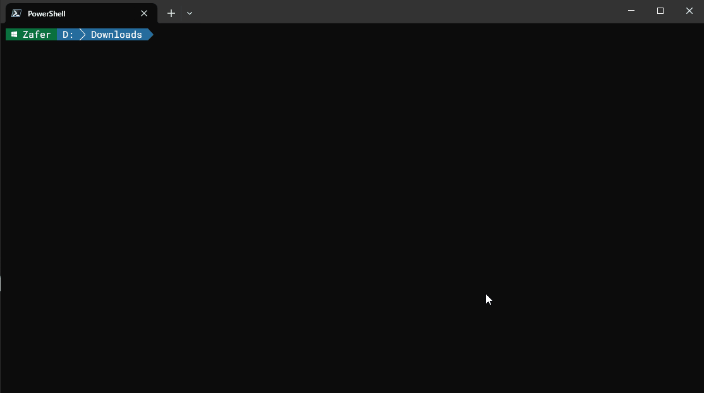

# wazuhevtx

A Python tool that parses EVTX files and converts them into JSON formatted logs mimicking Wazuh agent behavior in version 4.x. wazuhevtx is designed as a helper for `wazuh-logtest` tool.

Now, you can test your detection capabilities by replaying known attack samples such as [Windows EVTX Samples](https://github.com/sbousseaden/EVTX-ATTACK-SAMPLES).

**Note: It runs on Windows-only!** See Caveats below.

## Installation

### Alternative 1: Clone this repository

* Simply `git clone https://github.com/zbalkan/wazuhevtx.git` and start playing wih it.
* initiate your favorite virtual environment.
* Install dependencies using `pip install -r requirements.txt`
* Run the script by providing the path to evtx file.

### Alternative 2: Use `pip`/`pipx`

**I do not plan to deploy on PyPi unless the code is stable enough.**

If you plan to use the library and CLI:

* initiate your favorite virtual environment.
* Install the module using `pip install https://github.com/zbalkan/wazuhevtx/archive/refs/heads/main.zip`
* Run the script by providing the path to evtx file.

If you want to use only CLI tool:

* Install the module using `pipx install https://github.com/zbalkan/wazuhevtx/archive/refs/heads/main.zip`
* Run the script by providing the path to evtx file.

## Usage

### As a CLI tool

```shell
usage: wazuhevtx.py [-h] [-o OUTPUT] evtx

A Python tool that parses EVTX files and converts them into JSON formatted logs mimicking Wazuh agent behavior in version 4.x. wazuhevtx is designed as a helper for wazuh-logtest tool.

positional arguments:
  evtx                  Path to the Windows EVTX event log file

options:
  -h, --help            show this help message and exit
  -o OUTPUT, --output OUTPUT
                        Path of output JSON file. If not defined, output will be printed to console.
```

Check the animation for a speed run:



### As a library

You can use the package as a library to integrate into your scripts.

```python
from wazuhevtx.evtx2json import EvtxToJson

for log in converter.to_json(evtx_file):
    print(log)

```

## Caveats

### Windows-only

Due to Windows API dependencies of `win32evtlog`, the script works on Windows systems only. If you try on a Linux or Mac environment, you will get "This script is intended to be run on Windows." message, and the script will exit with error code 1.

### Workaround for testing

In order to be able to test with `wazuh-logtest` utility, you need a workaround as we are sending JSON logs, not `event_channel` format.

* Navigate to `/var/ossec/ruleset/rules/0575-win-base_rules.xml` file.
* Update the rule 60000 this way:

```xml
<rule id="60000" level="2">
    <!-- category>ossec</category -->
    <!-- decoded_as>windows_eventchannel</decoded_as -->
    <decoded_as>json</decoded_as>
    <field name="win.system.providerName">\.+</field>
    <options>no_full_log</options>
    <description>Group of windows rules.</description>
</rule>
```

### Corrupted EVTX files

If you encounter this error below, you will see that you cannot parse event logs. That is because I utilize Windows APIs, and by default the API does not provide a way to read or recover corrupted sections. If the file is corrupted, you cannot read it as a whole. I suggest using third party tools lie `CQEVTXRecovery` to recover files before using with `wazuhevtx`.

```plaintext
Error: The event log file is corrupted. (1500)
```

## Thanks

Thanks to [Birol Capa](https://github.com/birolcapa) for [his article](https://birolcapa.github.io/software/2021/09/24/how-to-read-evtx-file-using-python.html) pointing to the simplest way to parse EVTX files. Before that I tried many different solutions that were limited after some point.
